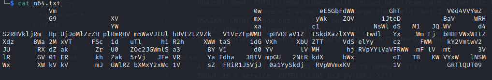

# Nintendo Base64
Solution:

Diberikan file yang jika dibaca.

Tinggal dibersihkan spasinya dan didecrypt base64 8 kali
```python
import base64
flag = open("n64.txt", "r").read().replace(" ", "").replace("\n", "")
for i in range(8):
    flag = base64.b64decode(flag)
print(flag)
```
flag: `CHTB{3nc0d1ng_n0t_3qu4l_t0_3ncrypt10n}`

# PhaseStream1
Solution:

Diberikan hex dari flag yang telah diencrypt dengan key 5 byte: 2e313f2702184c5a0b1e321205550e03261b094d5c171f56011904
```python
from pwn import xor
f = '2e313f2702184c5a0b1e321205550e03261b094d5c171f56011904'
print(xor(xor(bytes.fromhex(f), b'CHTB{')[:5], bytes.fromhex(f)))
```
flag: `CHTB{u51ng_kn0wn_pl41nt3xt}`
# PhaseStream2
Solution:

Diberikan file berisi 9999 baris hex. Flagnya dienkripsi menggunakan key 1 byte. Bisa dicari dengan cara yang sama dengan soal sebelumnya.

```python
from pwn import xor

f = open('ps2.txt', 'r').read().splitlines()
for i in f:
    key = xor(bytes.fromhex(i), b'C')[0]
    ans = xor(bytes.fromhex(i), key)
    if b'CHTB{' in ans:
        print(ans)
```
flag: `CHTB{n33dl3_1n_4_h4yst4ck}`

# PhaseStream3 
Solution:

Diberikan 2 file, satu file python untuk enkripsi, satu file hasil enkripsi. Enkripsi menggunakan AES CTR dengan counter yang sama. 
```python
test = b"No right of private conversation was enumerated in the Constitution. I don't suppose it occurred to anyone at the time that it could be prevented."
print(encrypt(test))
```
Flagnya dapat ditemukan dengan `xor(flag, test, test_encrypt), karena AES CTR merupakan stream cipher.

```python
from pwn import xor

test = b"No right of private conversation was enumerated in the Constitution. I don't suppose it occurred to anyone at the time that it could be prevented."
t = '464851522838603926f4422a4ca6d81b02f351b454e6f968a324fcc77da30cf979eec57c8675de3bb92f6c21730607066226780a8d4539fcf67f9f5589d150a6c7867140b5a63de2971dc209f480c270882194f288167ed910b64cf627ea6392456fa1b648afd0b239b59652baedc595d4f87634cf7ec4262f8c9581d7f56dc6f836cfe696518ce434ef4616431d4d1b361c'
f = '4b6f25623a2d3b3833a8405557e7e83257d360a054c2ea'

print(xor(bytes.fromhex(f), bytes.fromhex(t), test))
```
flag: `CHTB{r3u53d_k3Y_4TT4cK}`

# PhaseStream4
Solution:

Diberikan file yang hampir sama dengan soal sebelumnya, tetapi `test` disembunyikan. Akan tetapi cara menyelesaikannya kurang lebih sama. Analisis yang saya gunakan adalah menebak flag dan test sehingga lebih mudah untuk digoogle. Saya menemukan bahwa `test` yang dipakai adalah `I alone cannot change the world, but I can cast a stone across the water to create many ripples.`

flag: `CHTB{stream_ciphers_with_reused_keystreams_are_vulnerable_to_known_plaintext_attacks}`

# RSAJAM 
Solution:

Di soal diberikan nilai dari n, e, dan d. Dari sana bisa dihitung p dan q yang digunakan. Akan tetapi, private key yang dikirim tidak boleh sama dengan d yang diberikan. Oleh karena itu, saya menggunakan lambda yang merupakan carmichael function `LCM(p-1, q-1)`
```python
import random
from Crypto.Util.number import GCD, inverse
from pwn import remote

def LCM(a, b):
    return a * b // GCD(a, b)

def calc_p_q(e, d, n):
    k = d * e - 1
    t = 0
    while k % 2 == 0:
        k //= 2
        t += 1
    r = k
    done = 0
    for i in range(100):
        g = random.randrange(0, n)
        y = pow(g, r, n)
        if y == 1 or y == n-1:
            continue
        for j in range(1, t):
            x = pow(y, 2, n)
            if x == 1:
                done = 1
                break
            if x == n-1:
                done = 2
                break
            y = x

        if done == 1:
            break
        if done == 2:
            continue

        x = pow(y, 2, n)
        if x == 1:
            break
        
    p = GCD(y-1, n)
    q = n // p

    return p, q


host, port = "188.166.172.13", 30903
r = remote(host, port)

r.recvline()
resp = r.recvline().decode()
dr = eval(resp)

e = dr['e']
d = dr['d']
n = dr['N']

p, q = calc_p_q(e, d, n)
phi = LCM(p-1, q-1)
r.recv()
r.sendline(str(inverse(e, phi)))
r.interactive()
```

flag: `CHTB{lambda_but_n0t_lam3_bda}`

# SoulCrabber
Diberikan file rust yang intinya melakukan xor flag dengan stream yang berasal dari random generator. Diberikan juga seednya, tinggal ditulis ulang
```rust
use rand::rngs::StdRng;
use rand::{Rng, SeedableRng};
use std::char;

fn get_rng(seed: u64) -> StdRng {
    return StdRng::seed_from_u64(seed);
}

fn rand_xor(seed: u64, input: &[u8]) -> String {
    let mut rng = get_rng(seed);
    return input
        .into_iter()
        .map(|c| char::from_u32((c ^ rng.gen::<u8>()) as u32).unwrap())
        .collect::<String>();
}

fn main() {
    let enc_flag = [0x1b, 0x59, 0x14, 0x84, 0xdb, 0x96, 0x2f, 0x77, 0x82, 0xd1, 0x41, 0x0a, 0xfa, 0x4a, 0x38, 0x8f, 0x79, 0x30, 0x06, 0x7b, 0xce, 0xf6, 0xdf, 0x54, 0x6a, 0x57, 0xd9, 0xf8, 0x73];
    let flag = rand_xor(13371337, &enc_flag);
    println!("{}", flag);
}
```

flag: `CHTB{mem0ry_s4f3_crypt0_f41l}`

# Tetris
Solution:

Diberikan RNG yang sepertinya tidak bisa dipecahkan seednya. Lalu diberikan juga fungsi transpose string dengan key `L` antara 1-100. Lalu teks dienkripsi menggunakan monoalphabet substitution. Untuk transpose bisa dibruteforce dari 1-100, lalu masukkan ke quipqiup untuk solve substitutionnya.

Untuk bruteforce:
```python
def untranspose(x, l):
    size_ = (len(x)+l-1)//l
    mat = [[None] for _ in range(l)]
    res = ''
    for i in range(l):
            if i < len(x)%l:
                    mat[i] = x[i*size_ : i*size_+size_]
            else:
                    mat[i] = x[i*size_-(i-len(x)%l):i*size_-(i-len(x)%l)+size_-1]
    for i in range(size_):
            for j in range(l):
                    res += ('' if i >= len(mat[j]) else mat[j][i])
    return res

for i in range(1, 101):
    print(untranspose(enc, i))
```

Saya menemukan pada `i=61` dan hasil dekripsi quipqiup `chtb unfortunately quip qiup doesnt support transpositions`

flag: `CHTB{UNFORTUNATELYQUIPQIUPDOESNTSUPPORTTRANSPOSITIONS}`